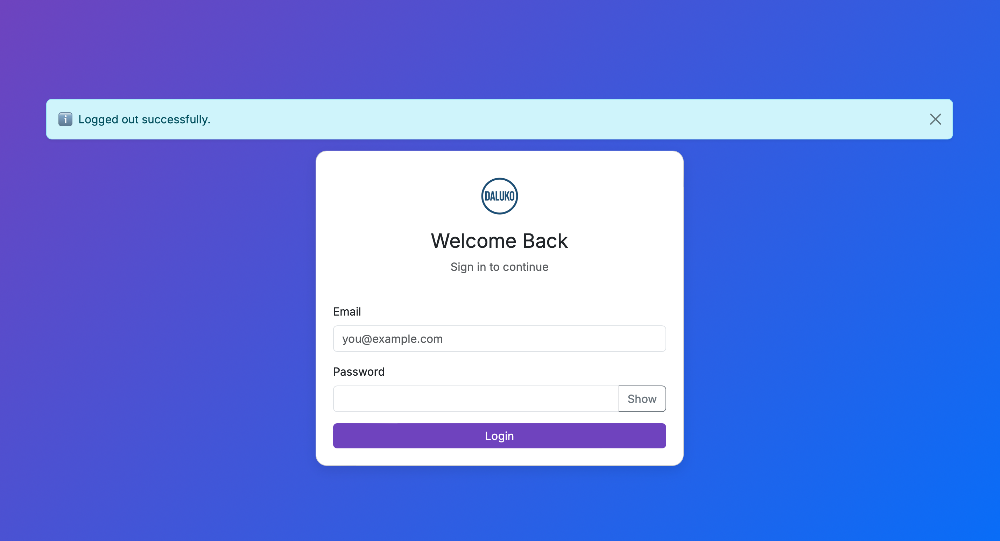
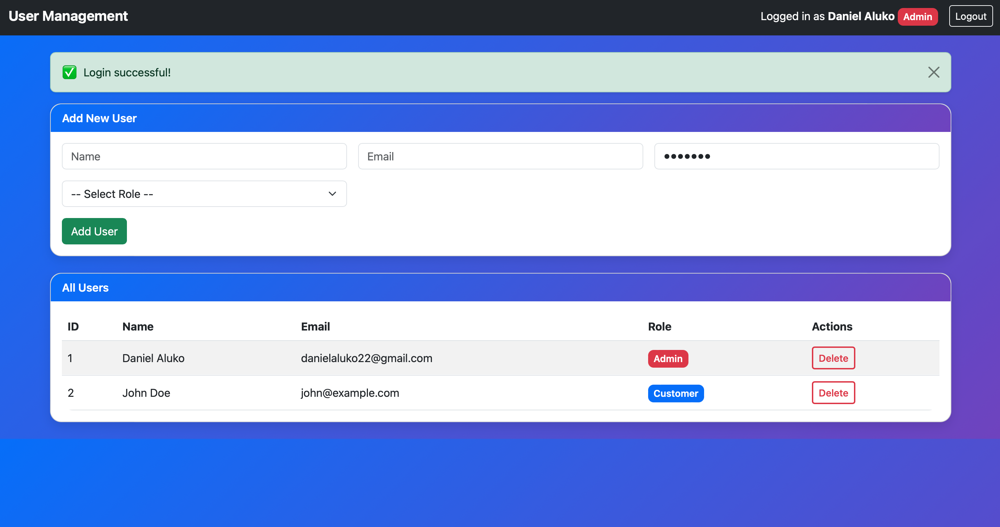
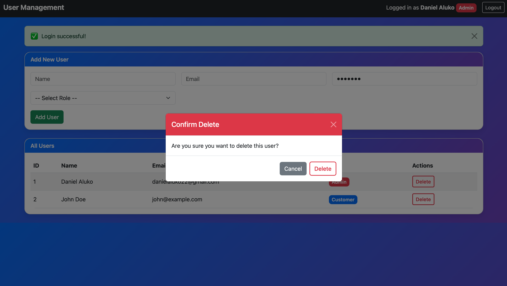
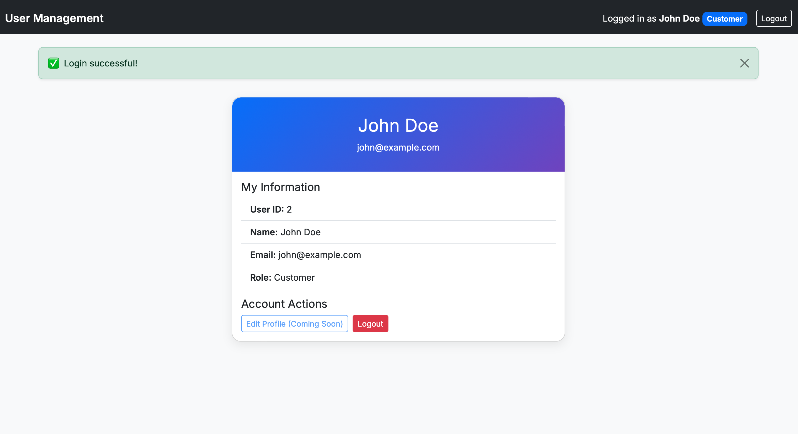

# DALUKO User Management System

A role-based **User Management System** built with **Flask**.  
This project demonstrates authentication, role-based access (Admin vs Customer), and a modern responsive UI using Bootstrap + custom DALUKO branding.

---

## 🚀 Features
- 🔐 Secure login with hashed passwords
- 👤 Role-based redirects:
  - **Admin** → Dashboard (add/delete users)
  - **Customer** → Profile page
- ⚡ Flash messages with custom styling (✅ ❌ ℹ️)
- 📱 Responsive design with Bootstrap 5
- 🎨 DALUKO theme (logo + gradient branding)
- 🗑️ Delete confirmation modal
- REST API endpoints for user management

---

## 📸 Screenshots

### Login Page


### Admin Dashboard


### Delete Confirmation


### Profile Page


---

## 🛠️ Tech Stack
- **Backend**: Flask, Flask-Login
- **Frontend**: Bootstrap 5, jQuery
- **Security**: Werkzeug password hashing

---

## ⚡ Quickstart

```bash
# Clone repository
git clone https://github.com/yourusername/daluko-user-management.git
cd daluko-user-management

# Create virtual environment
python3 -m venv venv
source venv/bin/activate   # Mac/Linux
venv\Scripts\activate      # Windows

# Install dependencies
pip install -r requirements.txt

# Run app
python app.py

👤 Default Accounts

* Admin
Email: danielaluko22@gmail.com
Password: test123

* Customer
Email: john@example.com
Password: customer123


